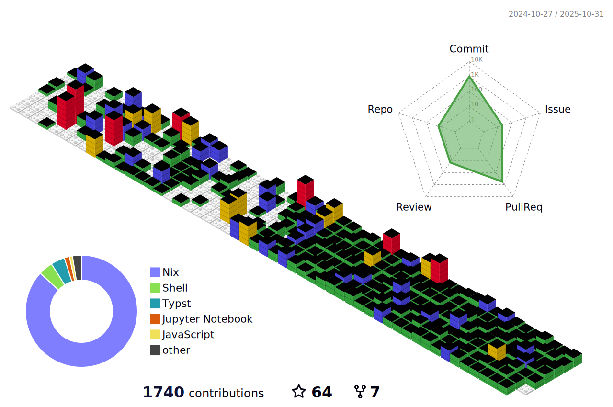

## Hi there :octocat:

[**Skip to projects :arrow_down:**](#projects)

[I'm Ananth](https://quantum9innovation.github.io). I used to write code in TypeScript (and, before that, JavaScript—oh, [the horror](https://www.reddit.com/r/ProgrammerHumor/comments/13rtual/the_novice_javascript_developer_seeks_absolute/)!), Python, and R. I suspect this will give me an ample supply of security vulnerabilities to fix. I later discovered [Haskell](https://www.haskell.org/) and realized that it is _the one true language_ ([this is a mathematically proven fact](https://theory.stanford.edu/~blynn/haskell/why.html)). Programming in Haskell (or theorizing, in this case) has the added benefit of giving you [whitepapers for free](https://www.youtube.com/shorts/LGZKXZQeEBg).
Learning Haskell has taught me to make sense of philosophical tautologies regarding the current state of the universe, like:

> "A monad is a monoid in the category of endofunctors, what's the problem?"\
> —Saunders MacLane

In order to remain sane when not writing Haskell, I am continuously configuring and optimizing my [**NixOS**](https://nixos.org/) system. This allows me to continue theorizing about [monadic software deployment](https://jade.fyi/blog/the-postmodern-build-system/) as I complete what should be trivial system tasks. I also believe that software should work well out-of-the-box, be updated regularly to support bleeding-edge features, and still allow for additional customization. Promoting [**user control over software**](https://www.gnu.org/philosophy/free-software-even-more-important.html) and enabling [**free software distribution**](https://www.gnu.org/philosophy/free-sw.en.html) are key to achieving these goals. I support software that meets the following three pillars of freedom:

- "Free" (gratis) as in "free beer" :beer:
- "Free" (libre) as in "free speech" :speech_balloon:
- "Free" (decentralized) as in "open source" :globe_with_meridians:

When I'm not trying to understand category theory, the basis of modern mathematics, or mathematical applications in computer science, I'm likely exploring mathematical economics and related fields, especially social choice theory and optimal taxation theory. I'm also quite interested in linguistics and computational linguistics in particular.

- 🔭 I’m currently working on [QuasarOS](https://github.com/quantum9innovation/quasaros), a (*)nix-based distro with some custom experimental hacks
- 📚 I’m currently learning [Lagrangian mechanics](https://www.feynmanlectures.caltech.edu/II_19.html)
- 🌱 Feel free to contribute to any of [my projects](https://github.com/quantum9innovation?tab=repositories)
- ❓ I’m looking for help redesigning [Proto](https://github.com/quantum9innovation/proto/tree/main), a language-learning application
- 💬 Ask me to explain [what a monad is](https://emorehouse.wescreates.wesleyan.edu/silliness/burrito_monads.pdf), [why most voting systems are wrong](https://arxiv.org/pdf/2004.02350), or [how elliptic curves are truly magical](https://www.jstor.org/stable/10.4169/math.mag.85.3.163)
- 📫 My email is <dev.quantum9innovation@gmail.com> (encrypt your message with [my PGP key](https://keys.openpgp.org/search?q=dev.quantum9innovation%40gmail.com) if possible—you can use free software like [Thunderbird](https://www.thunderbird.net/) to do this)
- ⚡ Fun fact: [Functors preserve isomorphisms](https://en.wikipedia.org/wiki/Functor#Properties), which means that if we can represent a branch of mathematics as a category (which we almost always can, given the [abstractness of category theory](https://en.wikipedia.org/wiki/Abstract_nonsense)), we can transform it to another branch of mathematics (represented as a category as well) and equality of objects (up to isomorphism) is unchanged. This is one of the fundamental ways that [category theory unifies all of mathematics](https://en.wikipedia.org/wiki/Unifying_theories_in_mathematics#Category_theory_as_a_rival) (See also [the only actual application of category theory to a comprehensible mathematical problem with (somewhat) practical rammifications](https://www.youtube.com/watch?v=Njx2ed8RGis)).

Below is a collection of banners associated with my profile, in no particular order:

<a href="https://nixos.org" target="_blank"></img></a>
<a href="https://haskell.org" target="_blank"></img></a>

<a href="https://typst.app" target="_blank"></img></a>
<a href="https://gitbutler.com" target="_blank"></img></a>
<a href="https://sw.kovidgoyal.net/kitty/" target="_blank"></img></a>

<a href="https://zen-browser.app" target="_blank"></img></a>

 

</img>
</img>
</img>

_Above left_: licensed under [CC BY-SA 2.5](https://creativecommons.org/licenses/by-sa/2.5/) by the [Artist Collective Superflex](https://freebeer.org/blog/wp-content/uploads/2007/07/label_stIves_v4.pdf). _Middle_: licensed under [CC BY 4.0](https://creativecommons.org/licenses/by/4.0/) by the [Free Software Foundation](https://www.fsf.org/resources/badges-es). No changes were made to either of the above images.

_Below_: licensed under [CC BY-ND 3.0](https://creativecommons.org/licenses/by-nd/3.0/) by the [Free Software Foundation](https://www.fsf.org/resources/badges). No changes or additions were made to this image.

## Projects
