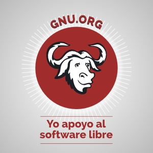

## Hi there :octocat:

[I'm Ananth](https://quantum9innovation.github.io). I used to write code in TypeScript (and, before that, JavaScript—oh, [the horror](https://www.reddit.com/r/ProgrammerHumor/comments/13rtual/the_novice_javascript_developer_seeks_absolute/)!), Python, and R. I suspect this will give me an ample supply of security vulnerabilities to fix. I later discovered [Haskell](https://www.haskell.org/) and realized that it is _the one true language_ ([this is a mathematically proven fact](https://theory.stanford.edu/~blynn/haskell/why.html)). Programming (or theorizing, in this case) in Haskell has the added benefit of giving you [whitepapers for free](https://www.youtube.com/shorts/LGZKXZQeEBg).
Learning Haskell has taught me to make sense of philosophical tautologies regarding the current state of the universe, like:

> "A monad is a monoid in the category of endofunctors, what's the problem?"\
> —Saunders MacLane

In order to remain sane when not writing Haskell, I am continuously configuring and optimizing my [**Arch Linux**](https://archlinux.org/) system.[^1] [Unlike most Arch users](https://wiki.archlinux.org/title/Frequently_asked_questions#Why_would_I_not_want_to_use_Arch?), I seek to maximize my use of well-designed GUIs and minimize reliance on primitive TUI infrastructure (perhaps one day I will write my own set of reasons to use Arch). I also believe that software should work well out-of-the-box, be updated regularly to support bleeding-edge features, and still allow for additional customization. Promoting [**user control over software**](https://www.gnu.org/philosophy/free-software-even-more-important.html) and enabling [**free software distribution**](https://www.gnu.org/philosophy/free-sw.en.html) are key to achieving these goals. I support software that meets the following three pillars of freedom:

- "Free" (gratis) as in "free beer" :beer:
- "Free" (libre) as in "free speech" :speech_balloon:
- "Free" (decentralized) as in "open source" :globe_with_meridians:

When I'm not trying to understand category theory, the basis of modern mathematics, or mathematical applications in computer science, I'm likely exploring mathematical economics and related fields, especially social choice theory and optimal taxation theory. I'm also quite interested in linguitics and computational linguistics in particular.

- 🔭 I’m currently working on **rewriting repositories in Haskell**
- 📚 I’m currently learning **category theory**
- 🌱 Feel free to contribute to any of [my projects](https://github.com/quantum9innovation?tab=repositories)
- ❓ I’m looking for help with redesigning [Proto](https://github.com/quantum9innovation/proto/tree/main), a language-learning application
- 💬 Ask me to explain [what a monad is](https://emorehouse.wescreates.wesleyan.edu/silliness/burrito_monads.pdf), [why most voting systems are wrong](https://arxiv.org/pdf/2004.02350), or [how elliptic curves are truly magical](https://www.jstor.org/stable/10.4169/math.mag.85.3.163)
- 📫 My email is <dev.quantum9innovation@gmail.com> (encrypt your message with [my PGP key](https://keys.openpgp.org/search?q=dev.quantum9innovation%40gmail.com) if possible—you can use free software like [Thunderbird](https://www.thunderbird.net/) to do this)
- ⚡ Fun fact: My profile photo depicts a [chiral, aperiodic monotiling of the plane](https://arxiv.org/abs/2305.17743) using strange objects called "Spectres"—to repeat that in English, this is a puzzle piece that can be used to cover any surface without repeating the same pattern forever

Below is a collection of banners associated with my profile, in no particular order:

<!-- TODO: add hyprland and other arch system utilities -->

<a href="https://archlinux.org" target="_blank"></img></a>
<a href="https://code.visualstudio.com/" target="_blank"></img></a>
<a href="https://haskell.org" target="_blank"></img></a>

<a href="https://typst.app" target="_blank"></img></a>
<a href="https://gitbutler.com" target="_blank"></img></a>
<a href="https://tabby.sh/" target="_blank"></img></a>

<a href="https://brave.com" target="_blank"></img></a>

 

</img>
</img>
</img>

_Above left_: licensed under [CC BY-SA 2.5](https://creativecommons.org/licenses/by-sa/2.5/) by the [Artist Collective Superflex](https://freebeer.org/blog/wp-content/uploads/2007/07/label_stIves_v4.pdf). _Middle_: licensed under [CC BY 4.0](https://creativecommons.org/licenses/by/4.0/) by the [Free Software Foundation](https://www.fsf.org/resources/badges-es). No changes were made to either of the above images.

_Below_: licensed under [CC BY-ND 3.0](https://creativecommons.org/licenses/by-nd/3.0/) by the [Free Software Foundation](https://www.fsf.org/resources/badges). No changes or additions were made to this image.

[^1]: Part of the terms and conditions that every Arch user agrees to mandates that they advertise their use of Arch Linux as part of their online identity.
